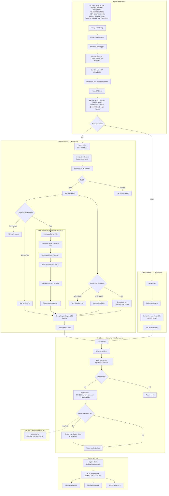

# SigNoz MCP Server — Architecture

## System Overview

```mermaid
flowchart TB

subgraph Startup["Server Initialization"]
    ENV["Env Vars: SIGNOZ_URL, SIGNOZ_API_KEY,<br/>LOG_LEVEL, TRANSPORT_MODE, MCP_SERVER_PORT,<br/>CLIENT_CACHE_SIZE, CLIENT_CACHE_TTL_MINUTES"]
    ENV --> CFG["config.LoadConfig"]
    CFG --> VALIDATE["config.ValidateConfig"]
    VALIDATE --> LOG["telemetry.NewLogger"]
    LOG --> OTEL["Init OpenTelemetry<br/>(Tracer, Meter, Log Provider)"]
    OTEL --> HANDLER["Handler with LRU clientCache"]
    HANDLER --> CHSCHEMA["dashboard.InitClickhouseSchema"]
    CHSCHEMA --> MCPSRV["NewMCPServer"]
    MCPSRV --> REGISTER["Register all tool handlers<br/>(Metrics, Alerts, Dashboards, Services,<br/>QueryBuilderV5, Logs, Traces)"]
    REGISTER --> MODE{"TransportMode?"}
end

subgraph StdioPath["Stdio Transport — Single Tenant"]
    MODE -->|stdio| STDIO["ServeStdio"]
    STDIO --> CTXFUNC["StdioContextFunc"]
    CTXFUNC --> SETCTX_S["Set apiKey and signozURL<br/>from env into ctx"]
    SETCTX_S --> TOOL_S["Tool Handler Called"]
end

subgraph HTTPPath["HTTP Transport — Multi Tenant"]
    MODE -->|http| HTTP["HTTP Server<br/>/mcp + /healthz"]
    HTTP --> OTELWRAP["otelhttp.NewHandler<br/>(wraps entire mux)"]
    OTELWRAP --> REQ["Incoming HTTP Request"]
    REQ --> HEALTHCHECK{"Path?"}

    HEALTHCHECK -->|/healthz| HC200["200 OK — no auth"]
    HEALTHCHECK -->|/mcp| AUTH["authMiddleware"]

    AUTH --> APIKEY{"Authorization header?"}
    APIKEY -->|Yes| PARSE["Extract apiKey<br/>(Bearer or raw token)"]
    APIKEY -->|No + env set| ENVKEY["Use config.APIKey"]
    APIKEY -->|No + no env| DENY["401 Unauthorized"]

    AUTH --> URLCHECK{"X-SigNoz-URL header?"}
    URLCHECK -->|Yes| NORMALIZE["normalizeSigNozURL"]
    URLCHECK -->|No + env set| ENVURL["Use config.URL"]
    URLCHECK -->|No + no env| NOURL["400 Bad Request"]

    subgraph URLValidation["URL Validation (normalizeSigNozURL)"]
        NORMALIZE --> SCHEME["Validate scheme (http/https only)"]
        SCHEME --> PATHCHECK["Reject path/query/fragment"]
        PATHCHECK --> LOCALHOST["Block localhost, 0.0.0.0, [::]"]
        LOCALHOST --> STRIPPORT["Strip default ports (80/443)"]
        STRIPPORT --> ORIGIN["Return canonical origin"]
    end

    ORIGIN --> SETCTX_H["Set apiKey and signozURL into ctx"]
    PARSE --> SETCTX_H
    ENVKEY --> SETCTX_H
    ENVURL --> SETCTX_H

    SETCTX_H --> TOOL_H["Tool Handler Called"]
end

subgraph GetClient["GetClient — Unified for Both Transports"]
    TOOL["Tool Handler"]
    TOOL --> TLOG["tenantLogger(ctx)"]
    TLOG --> READ["Read apiKey and signozURL from ctx"]
    READ --> MISSING{"Both present?"}

    MISSING -->|No| ERR["Return error"]
    MISSING -->|Yes| HASH["cacheKey = SHA256(apiKey + delimiter + signozURL)"]

    HASH --> LOOKUP{"clientCache LRU hit?"}
    LOOKUP -->|Yes| HIT["Return cached client"]
    LOOKUP -->|No| CREATE["Create new SigNoz client and cache it"]

    CREATE --> HIT
end

subgraph Cache["Bounded Cache (expirable LRU)"]
    LRU_C["clientCache<br/>maxSize: 256, TTL: 30min"]
end

subgraph APICall["SigNoz API Call"]
    CLIENT["SigNoz Client<br/>(otelhttp instrumented)"]
    CLIENT --> APIREQ["HTTP Request with SIGNOZ-API-KEY header"]
    APIREQ --> S1["SigNoz Instance 1"]
    APIREQ --> S2["SigNoz Instance 2"]
    APIREQ --> SN["SigNoz Instance N"]
end

TOOL_S --> TOOL
TOOL_H --> TOOL
HIT --> CLIENT

LOOKUP -.->|read/write| LRU_C
```
