# SigNoz MCP Server — Architecture

## System Overview

```mermaid
flowchart TB

subgraph Startup["Server Initialization"]
    ENV["Env Vars: SIGNOZ_URL, SIGNOZ_API_KEY,<br/>LOG_LEVEL, TRANSPORT_MODE, MCP_SERVER_PORT,<br/>CLIENT_CACHE_SIZE, CLIENT_CACHE_TTL_MINUTES,<br/>OAUTH_ENABLED, OAUTH_TOKEN_SECRET, OAUTH_ISSUER_URL,<br/>OTEL_EXPORTER_OTLP_*"]
    ENV --> CFG["config.LoadConfig"]
    CFG --> VALIDATE["config.ValidateConfig"]
    VALIDATE --> LOG["log.New"]
    LOG --> OTEL["Init OpenTelemetry<br/>(Tracer, Meter; OTLP export only when configured)"]
    OTEL --> HANDLER["Handler with LRU clientCache"]
    HANDLER --> CHSCHEMA["dashboard.InitClickhouseSchema"]
    CHSCHEMA --> MCPSRV["NewMCPServer"]
    MCPSRV --> REGISTER["Register all tool handlers<br/>(Metrics, TopMetrics, MetricUsage, Alerts, Dashboards, Services,<br/>QueryBuilderV5, Logs, Docs, Traces)"]
    REGISTER --> MODE{"TransportMode?"}
end

subgraph StdioPath["Stdio Transport — Single Tenant"]
    MODE -->|stdio| STDIO["ServeStdio"]
    STDIO --> CTXFUNC["StdioContextFunc"]
    CTXFUNC --> SETCTX_S["Set apiKey and signozURL<br/>from env into ctx"]
    SETCTX_S --> TOOL_S["Tool Handler Called"]
end

subgraph HTTPPath["HTTP Transport — Multi Tenant"]
    MODE -->|http| HTTP["HTTP Server<br/>/mcp + /healthz + /livez + /readyz + /oauth/* + /.well-known/*"]
    HTTP --> OTELWRAP["otelhttp.NewHandler<br/>(wraps entire mux)"]
    OTELWRAP --> REQ["Incoming HTTP Request"]
    REQ --> HEALTHCHECK{"Path?"}

    HEALTHCHECK -->|/livez| LIVE["200 OK — liveness only, no dependency checks"]
    HEALTHCHECK -->|/healthz| HC200["Legacy health check<br/>same strict status as /readyz"]
    HEALTHCHECK -->|/readyz| READY["200 when docs index is ready<br/>503 while docs index is warming"]
    HEALTHCHECK -->|/.well-known/*<br/>/oauth/*| OAUTHFLOW["OAuth 2.1 Endpoints<br/>(no auth required)"]
    HEALTHCHECK -->|/mcp| AUTH["authMiddleware"]

    AUTH --> APIKEY{"Authorization header?"}
    APIKEY -->|Yes + OAuth enabled| TRYDECRYPT["Try decrypt as OAuth token"]
    TRYDECRYPT -->|Success| OAUTHCTX["Extract apiKey + signozURL<br/>from encrypted token"]
    TRYDECRYPT -->|Expired| EXPIRED["401 + WWW-Authenticate challenge"]
    TRYDECRYPT -->|Not OAuth format| RAWKEY["Forward token upstream<br/>as Authorization: Bearer"]
    APIKEY -->|Yes + OAuth disabled| PARSE["Forward token upstream<br/>as Authorization: Bearer"]
    APIKEY -->|No + OAuth enabled| CHALLENGE["401 + WWW-Authenticate<br/>resource_metadata URL"]
    APIKEY -->|No + env set| ENVKEY["Use config.APIKey"]
    APIKEY -->|No + no env| DENY["401 Unauthorized"]

    AUTH --> URLCHECK{"SigNoz URL source?"}
    URLCHECK -->|OAuth token| FROMTOKEN["Already extracted<br/>from decrypted token"]
    URLCHECK -->|X-SigNoz-URL header| NORMALIZE["normalizeSigNozURL"]
    URLCHECK -->|env set| ENVURL["Use config.URL"]
    URLCHECK -->|none| NOURL["400 Bad Request"]

    subgraph URLValidation["URL Validation (normalizeSigNozURL)"]
        NORMALIZE --> SCHEME["Validate scheme (http/https only)"]
        SCHEME --> PATHCHECK["Reject path/query/fragment"]
        PATHCHECK --> LOCALHOST["Block localhost, 0.0.0.0, [::]"]
        LOCALHOST --> STRIPPORT["Strip default ports (80/443)"]
        STRIPPORT --> ORIGIN["Return canonical origin"]
    end

    ORIGIN --> SETCTX_H["Set apiKey and signozURL into ctx"]
    PARSE --> SETCTX_H
    OAUTHCTX --> SETCTX_H
    RAWKEY --> SETCTX_H
    ENVKEY --> SETCTX_H
    ENVURL --> SETCTX_H

    SETCTX_H --> TOOL_H["Tool Handler Called"]
end

subgraph OAuthFlow["OAuth 2.1 Flow (Stateless)"]
    direction TB
    DISC["Client: GET /.well-known/oauth-protected-resource<br/>GET /.well-known/oauth-authorization-server"]
    DISC --> REGCLIENT["POST /oauth/register<br/>{client_name, redirect_uris}"]
    REGCLIENT --> ENCID["client_id = encrypt(redirect_uris, name)"]
    ENCID --> AUTHPAGE["GET /oauth/authorize<br/>Browser opens, user sees form"]
    AUTHPAGE --> SUBMIT["POST /oauth/authorize<br/>User submits SigNoz URL + API key"]
    SUBMIT --> VALIDATE["Normalize SigNoz URL and validate<br/>credentials against SigNoz API"]
    VALIDATE -->|success| ENCCODE["auth_code = encrypt(api_key, signoz_url,<br/>client_id, redirect_uri, code_challenge)"]
    VALIDATE -->|invalid URL / rejected creds / unreachable instance| AUTHPAGEERR["Re-render authorize page<br/>with inline error"]
    ENCCODE --> REDIRECT["302 Redirect to client<br/>with ?code=encrypted"]
    REDIRECT --> EXCHANGE["POST /oauth/token<br/>{code, code_verifier}"]
    EXCHANGE --> VERIFY["Decrypt code, verify PKCE,<br/>verify client_id + redirect_uri match"]
    VERIFY --> ISSUE["access_token = encrypt(api_key, signoz_url)<br/>refresh_token = encrypt(api_key, signoz_url)"]
    ISSUE --> USE["Client uses access_token on /mcp<br/>Middleware decrypts → apiKey + signozURL"]

    REFRESH["POST /oauth/token<br/>{grant_type: refresh_token}"]
    REFRESH --> DECREF["Decrypt refresh_token<br/>→ api_key, signoz_url"]
    DECREF --> ISSUE
end

subgraph GetClient["GetClient — Unified for Both Transports"]
    TOOL["Tool Handler"]
    TOOL --> TLOG["tenantLogger(ctx)"]
    TLOG --> READ["Read apiKey and signozURL from ctx"]
    READ --> MISSING{"Both present?"}

    MISSING -->|No| ERR["Return error"]
    MISSING -->|Yes| HASH["cacheKey = SHA256(apiKey + delimiter + signozURL)"]

    HASH --> LOOKUP{"clientCache LRU hit?"}
    LOOKUP -->|Yes| HIT["Return cached client"]
    LOOKUP -->|No| CREATE["Create new SigNoz client and cache it"]

    CREATE --> HIT
end

subgraph Cache["Bounded Cache (expirable LRU)"]
    LRU_C["clientCache<br/>maxSize: 256, TTL: 30min"]
end

subgraph APICall["SigNoz API Call"]
    CLIENT["SigNoz Client<br/>(otelhttp instrumented)"]
    CLIENT --> APIREQ["HTTP Request with SIGNOZ-API-KEY header"]
    APIREQ --> S1["SigNoz Instance 1"]
    APIREQ --> S2["SigNoz Instance 2"]
    APIREQ --> SN["SigNoz Instance N"]
end

TOOL_S --> TOOL
TOOL_H --> TOOL
HIT --> CLIENT

LOOKUP -.->|read/write| LRU_C
```

## Stateless Transport

The Streamable HTTP transport (`/mcp`) runs fully stateless: the server is built with
`WithStateLess(true)`, so it issues no `Mcp-Session-Id` and registers no session state for
POST requests. (An open GET listening stream still holds transient SDK-level stream state for
its lifetime, which is harmless here — see below.) Every request is self-contained — auth
credentials and the SigNoz URL are resolved per request in `authMiddleware` (from the OAuth
token, headers, or env), tools and resources are static, and the server uses no sampling or
server→client messaging.

Any instance can therefore serve any request behind a plain round-robin load balancer — no
sticky sessions or session affinity — mirroring the OAuth token design below. It also avoids
the per-session maps the MCP SDK would otherwise accumulate, and aligns with the MCP
`2026-07-28` spec direction of removing the protocol-level session model. Clients may still
open a GET listening stream; a periodic heartbeat keeps it alive through intermediary proxies.

The successful `initialize` request emits `MCP Client: Initialized` with its client
name/version and negotiated protocol version. This is client-adoption telemetry, not a
session lifecycle signal: there is still no reliable cross-request session identity for
attaching `ClientInfo` to later tool events. Per-request `clientSource` and assistant
correlation headers remain available on tool telemetry.

## OAuth 2.1 — Stateless Token Design

The OAuth implementation is fully stateless — no database or in-memory store is needed. All state is encrypted into the tokens themselves using AES-GCM with a shared `OAUTH_TOKEN_SECRET`.

### Encrypted Blob Types

Each blob is prefixed with a type byte to prevent cross-type confusion:

| Type | Blob | Contents | Created At | Used At |
|------|------|----------|------------|---------|
| `0x01` | `client_id` | `{redirect_uris, client_name, created_at}` | `/oauth/register` | `/oauth/authorize` |
| `0x02` | `authorization_code` | `{api_key, signoz_url, client_id, redirect_uri, code_challenge, expires_at}` | `/oauth/authorize` (form submit) | `/oauth/token` |
| `0x03` | `refresh_token` | `{api_key, signoz_url, client_id, expires_at}` | `/oauth/token` | `/oauth/token` (refresh grant) |
| (untagged) | `access_token` | `{api_key, signoz_url, client_id, expires_at}` | `/oauth/token` | `/mcp` (every request) |

### Multi-Instance Deployment

Since tokens are self-contained encrypted blobs, any server instance with the same `OAUTH_TOKEN_SECRET` can validate any token. No sticky sessions or shared state needed. The only requirement is that all instances share the same encryption key.

### Credential header routing

The auth middleware forwards each credential upstream on the **header the client used** — SigNoz classifies credentials by header name, not token shape:

- `SIGNOZ-API-KEY: <key>` → forwarded as `SIGNOZ-API-KEY` (service-account API keys).
- `Authorization: [Bearer] <token>` → forwarded as `Authorization: Bearer <token>` (user/session tokens, JWT **or** opaque).

When OAuth is enabled, the middleware first tries to decrypt an `Authorization` Bearer token as a server-issued OAuth access token; a valid one unwraps to a stored API key forwarded via `SIGNOZ-API-KEY`. Only if decryption fails (and a SigNoz URL is available) is the token treated as a direct credential and forwarded on `Authorization`.

> **Removed (breaking):** earlier versions used a shape heuristic (`isJWTToken`) to reroute non-JWT `Authorization` tokens to `SIGNOZ-API-KEY`. That heuristic misrouted opaque user/session tokens (which SigNoz only accepts on `Authorization`) and has been removed. Clients sending a service-account API key must use the `SIGNOZ-API-KEY` header, not `Authorization`.
